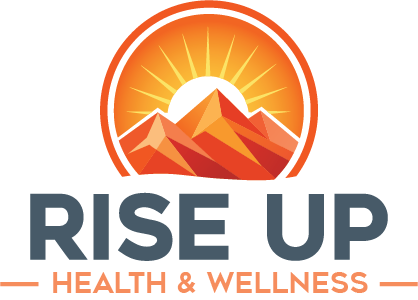

# RiseUp Health & Wellness

  

RiseUp Health & Wellness builds practical, community-rooted care experiences for patients, families, referral partners, and care teams in West Virginia.

Our public technology work supports a simple goal: make it easier for people to understand available care, find the right next step, and connect with trusted channels without asking them to share sensitive clinical details in the wrong place.

## What We Build

- Public web experiences for patients, families, and referral partners
- Content systems for healthcare communication and service information
- Infrastructure for reliable, secure deployment on Google Cloud
- Integration boundaries for scheduling, patient access, referrals, and future vendor systems

## How We Work

We design for clarity, privacy, accessibility, and long-term maintainability. Healthcare software should reduce confusion, respect patient trust, and avoid collecting protected health information unless the system has been explicitly designed for that responsibility.

## Current Focus

- Marketing website and CMS-managed public content
- Cloud Run deployment and infrastructure automation
- Clear handoffs to approved patient portal, scheduling, intake, and referral systems

## Public Site

Visit RiseUp Health & Wellness at [riseupwv.org](https://riseupwv.org).

For urgent medical concerns, call 911 or use an approved care channel. GitHub is not monitored for patient care, appointments, referrals, or protected health information.
